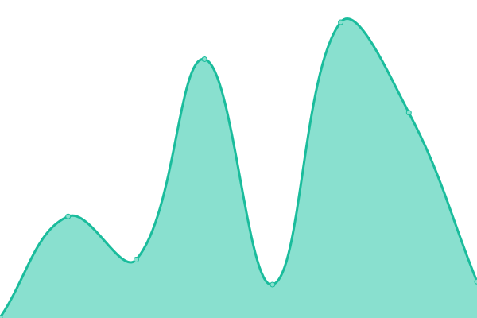
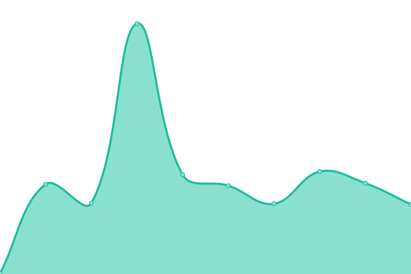

# [📈 Live Status](https://upptime.github.io/upptime): <!--live status--> **🟩 All systems operational**

This repository contains the open-source uptime monitor and status page for [Upptime](https://upptime.js.org), powered by [Upptime](https://github.com/upptime/upptime).

With [Upptime](https://upptime.js.org), you can get your own unlimited and free uptime monitor and status page, powered entirely by a GitHub repository. We use [Issues](https://github.com/upptime/upptime/issues) as incident reports, [Actions](https://github.com/zurgnflx/uptime/actions) as uptime monitors, and [Pages](https://upptime.github.io/upptime) for the status page.

<!--start: status pages-->
<!-- This summary is generated by Upptime (https://github.com/upptime/upptime) -->
<!-- Do not edit this manually, your changes will be overwritten -->
<!-- prettier-ignore -->
| URL | Status | History | Response Time | Uptime |
| --- | ------ | ------- | ------------- | ------ |
|  [genflix.co.id](https://genflix.co.id) | 🟩 Up | [genflix-co-id.yml](https://github.com/zurgnflx/uptime/commits/HEAD/history/genflix-co-id.yml) | 

 408ms
     
 | 

<a href="https://zurgnflx.github.io/uptime/history/genflix-co-id">100.00%</a>
    

|  [sushiroll.co.id](https://sushiroll.co.id) | 🟩 Up | [sushiroll-co-id.yml](https://github.com/zurgnflx/uptime/commits/HEAD/history/sushiroll-co-id.yml) | 

 786ms
     
 | 

<a href="https://zurgnflx.github.io/uptime/history/sushiroll-co-id">100.00%</a>
    

|  [bo-payment](https://bo-payment.genflix.co.id/auth/) | 🟩 Up | [bo-payment.yml](https://github.com/zurgnflx/uptime/commits/HEAD/history/bo-payment.yml) | 

 960ms
     
 | 

<a href="https://zurgnflx.github.io/uptime/history/bo-payment">100.00%</a>
    

|  [payment.genflix](https://payment.genflix.co.id/healthcheck.php) | 🟩 Up | [payment-genflix.yml](https://github.com/zurgnflx/uptime/commits/HEAD/history/payment-genflix.yml) | 

 949ms
     
 | 

<a href="https://zurgnflx.github.io/uptime/history/payment-genflix">100.00%</a>
    

|  [payment.sushiroll](https://payment.sushiroll.co.id/) | 🟩 Up | [payment-sushiroll.yml](https://github.com/zurgnflx/uptime/commits/HEAD/history/payment-sushiroll.yml) | 

 1842ms
     
 | 

<a href="https://zurgnflx.github.io/uptime/history/payment-sushiroll">100.00%</a>
    

|  [genflix-prd-catalog](https://prd.genflix.co.id/catalog/v1.0/showCategories?page=1&perPage=20) | 🟩 Up | [genflix-prd-catalog.yml](https://github.com/zurgnflx/uptime/commits/HEAD/history/genflix-prd-catalog.yml) | 

 407ms
     
 | 

<a href="https://zurgnflx.github.io/uptime/history/genflix-prd-catalog">100.00%</a>
    

|  [genflix-prd-screen](https://prd.genflix.co.id/screen/v1.0/countries/current) | 🟩 Up | [genflix-prd-screen.yml](https://github.com/zurgnflx/uptime/commits/HEAD/history/genflix-prd-screen.yml) | 

 253ms
     
 | 

<a href="https://zurgnflx.github.io/uptime/history/genflix-prd-screen">100.00%</a>
    

|  [genflix-prd-user](https://prd.genflix.co.id/user/v1.1/profile/8535c63b-3523-4aa2-b3e0-b565ec7464cd/public) | 🟩 Up | [genflix-prd-user.yml](https://github.com/zurgnflx/uptime/commits/HEAD/history/genflix-prd-user.yml) | 

 338ms
     
 | 

<a href="https://zurgnflx.github.io/uptime/history/genflix-prd-user">100.00%</a>
    

|  [genflix-prd-heartbeat](https://prd.genflix.co.id/heartbeat/v1.0/media) | 🟩 Up | [genflix-prd-heartbeat.yml](https://github.com/zurgnflx/uptime/commits/HEAD/history/genflix-prd-heartbeat.yml) | 

 233ms
     
 | 

<a href="https://zurgnflx.github.io/uptime/history/genflix-prd-heartbeat">100.00%</a>
    

|  [genflix-prd-loyalty](https://prd.genflix.co.id) | 🟩 Up | [genflix-prd-loyalty.yml](https://github.com/zurgnflx/uptime/commits/HEAD/history/genflix-prd-loyalty.yml) | 

 228ms
     
 | 

<a href="https://zurgnflx.github.io/uptime/history/genflix-prd-loyalty">100.00%</a>
    

|  [genflix-prd-subscription](https://prd.genflix.co.id/subscription/v1.1/packages/public) | 🟩 Up | [genflix-prd-subscription.yml](https://github.com/zurgnflx/uptime/commits/HEAD/history/genflix-prd-subscription.yml) | 

 265ms
     
 | 

<a href="https://zurgnflx.github.io/uptime/history/genflix-prd-subscription">100.00%</a>
    

|  [genflix-prd-recommendation](https://prd.genflix.co.id) | 🟩 Up | [genflix-prd-recommendation.yml](https://github.com/zurgnflx/uptime/commits/HEAD/history/genflix-prd-recommendation.yml) | 

 227ms
     
 | 

<a href="https://zurgnflx.github.io/uptime/history/genflix-prd-recommendation">100.00%</a>
    

|  [msap-fcl](http://117.54.9.47:4501/healthcheck.php) | 🟩 Up | [msap-fcl.yml](https://github.com/zurgnflx/uptime/commits/HEAD/history/msap-fcl.yml) | 

 406ms
     
 | 

<a href="https://zurgnflx.github.io/uptime/history/msap-fcl">100.00%</a>
    

|  [msap-fdn](http://117.54.9.45:4501/healthcheck.php) | 🟩 Up | [msap-fdn.yml](https://github.com/zurgnflx/uptime/commits/HEAD/history/msap-fdn.yml) | 

 407ms
     
 | 

<a href="https://zurgnflx.github.io/uptime/history/msap-fdn">100.00%</a>
    

<!--end: status pages-->

[**Visit our status website →**](https://upptime.github.io/upptime)

## 📄 License

- Powered by: [Upptime](https://github.com/upptime/upptime)
- Code: [MIT](./LICENSE) © [Upptime](https://upptime.js.org)
- Data in the `./history` directory: [Open Database License](https://opendatacommons.org/licenses/odbl/1-0/)
